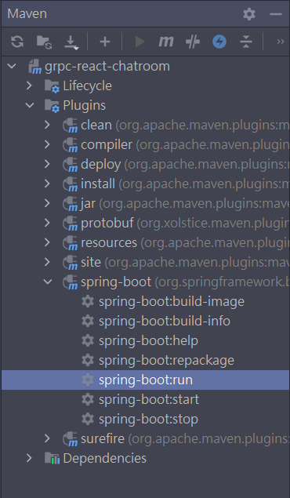

# Normal Startup

1. 啟動backend



1. 開啟envoy

```yaml
docker build -t grpc-envoy .
docker run -d -p 8081:8081 --name grpc-envoy-server grpc-envoy
```


1. 進到frontend

```bash
npm install google-protobuf grpc-web --save
npm install protoc-gen-grpc-web -g
npm run start
```

# 效果


# 參考

[https://daily.dev/blog/build-a-chat-app-using-grpc-and-reactjs#chatpage](https://daily.dev/blog/build-a-chat-app-using-grpc-and-reactjs#chatpage)